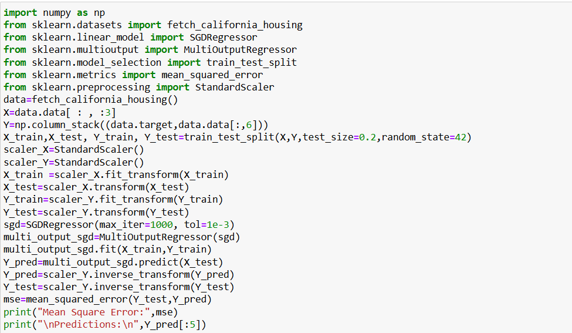
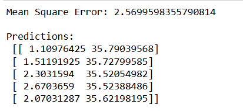

# SGD-Regressor-for-Multivariate-Linear-Regression

## AIM:
To write a program to predict the price of the house and number of occupants in the house with SGD regressor.

## Equipments Required:
1. Hardware – PCs
2. Anaconda – Python 3.7 Installation / Jupyter notebook

## Algorithm
1. Load California housing data, select features and targets, and split into training and testing sets. 
2.  Scale both X (features) and Y (targets) using StandardScaler
3.  Use SGDRegressor wrapped in MultiOutputRegressor to train on the scaled training data.  
4.  Predict on test data, inverse transform the results, and calculate the mean squared error

## Program:

Developed by:PRAGATHI KUMAR 

RegisterNumber:212224230200
 

## Output:

## Result:
Thus the program to implement the multivariate linear regression model for predicting the price of the house and number of occupants in the house with SGD regressor is written and verified using python programming.
